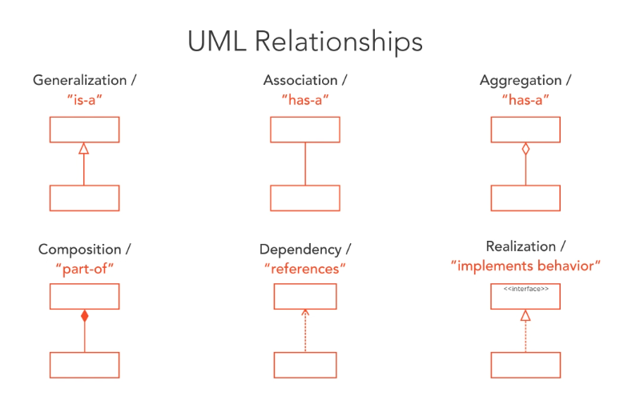

# UML Basics

## Associations I
- Represented by a single line between classes
- Directed Association (not tightly coupled circular association, e.g. Trip knows about Expenses AND Expenses know about Trip) can be represented by an arrow from the class tha "knows" about the other class. Trip ---> Expense
- Multiplicity can be represented by:
    - Zero to Many *
    - Zero to One 0..1
    - Exactly One 1
    - Default is 1

## Generilization
Express one model element based on another. Inheritance.
Represented by a hollow (white) arrow end.
E.g. a Trip has an attribute called "-expenses" which happens to be the Expense type.

## Dependency
Class refers to another class. E.g. like through a method parameter
Represented by  dashed line with an open arrow (crow foot).
E.g. a Trip has a method called addNote() which takes in a parameter of type Note.

## Associations II types
### Aggregation
Represents a part-whole relationship
Represented by a solid line with hollow diamond at the OWNERS end.
Almost redundant as it representes the same as an Association

### Composition
Equals Ownership. Type of association
Show the parts live AND die with the whole. When object is destroyed, all containing objects are destroyed too.
Represented by a solid line with solid diamond.

## Realization
A class implements the behaviour specified by another model element.
Represented by a dashed line with hollow arrow on the interface end.

# Summary

